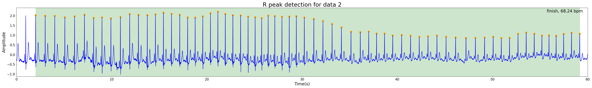
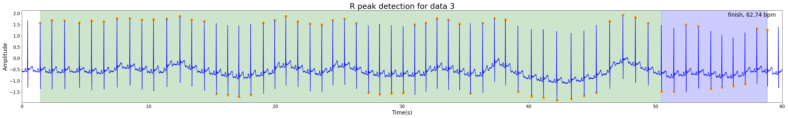
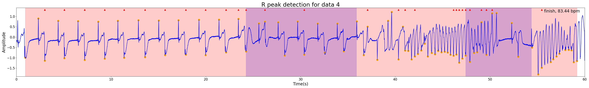
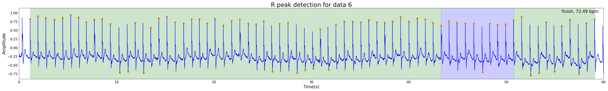
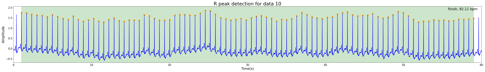

# Realtime ECG QRS Detection and Diagnosis

## Description

Pan-Tompkins Algorithm for ECG Signal Real-Time QRS Detection and Diagnosis.

This is a project for the course "Biomedical Electronics 2 - Instruments" in the third year of Biomedical Engineering at Tsinghua University. The goal is to achieve real-time detection of ECG signals, automatically calculate heart rate, and detect premature beats.

## Usage

### Clone the repositories

```
git clone https://github.com/zjl21/Realtime-ECG-QRS-detection-and-diagnosis.git
```

### Add your data

Organize your data into a txt file and place it in the `data` folder, when referred to "your data idx" below, it means the part before the .txt. 

There are 10 demo data currently in the `data` folder.

### Run the code

There are three modes of operation:

1. **Mode 1:** See the realtime detection process, run
```python main.py --config config.ini --visualize --data_idx "your data idx"```
2. **Mode 2:** See the result for each detection, run
```python main.py --config config.ini --show_result --data_idx "your data idx"``` 
3. **Mode 3:** Evaluate the accuracy in comparison with the reference dataset, run
```python main.py --evaluate --data_idx "your data idx"```

When using Mode 3, don't forget to put the corresponding annotation file to the `reference` folder, the mapping can be changed in `evaluate.py`.

Three modes can be used simultaneously.

## Algorithm Overview

The QRS detection algorithm is based on the Pan-Tompkins method for real-time QRS detection in ECG signals. The basic principles include:

1. **Bandpass Filtering**
2. **Differentiation**
3. **Squaring**
4. **Moving Window Integration**
5. **Adaptive Thresholding**

The diagnosis algorithm is based on the width of QRS peaks and the quotient of RR intervals.

For more detailed information, please refer to [my experiment report](./实验报告/生物医学电子学大作业_郑佳兰_2021012136.pdf).

## Results and Illustrations

The result for the 10 demo data is shown as below.

The orange dots stand for the QRS peaks, the part of different colors show the normal heart rate, tachycardia and bradycardia in green, red and blue. You can also change the color in config file.











## Limitations

- **Edge Data Detection:** The algorithm ignores the QRS in initial and final segments of the data.
- **Premature Beat Detection:** The accuracy of detecting premature beats is not high.

## Reference

- Jeongwhan Lee, Keesam Jeong, Jiyoung Yoon, and Myoungho Lee. A simple real-time QRS detection algorithm. In Proceedings of 18th Annual International Conference of the IEEE Engineering in
Medicine and Biology Society, volume 4, pages 1396–1398, Amsterdam, Netherlands, 1997. IEEE.

- QRS-detection/util/QRS_util.py at master ·KChen89/QRS-detection.

- real-time-QRS-detection/ECG_diagnosis.m at master ·TianleCao/real-time-QRS-detection.